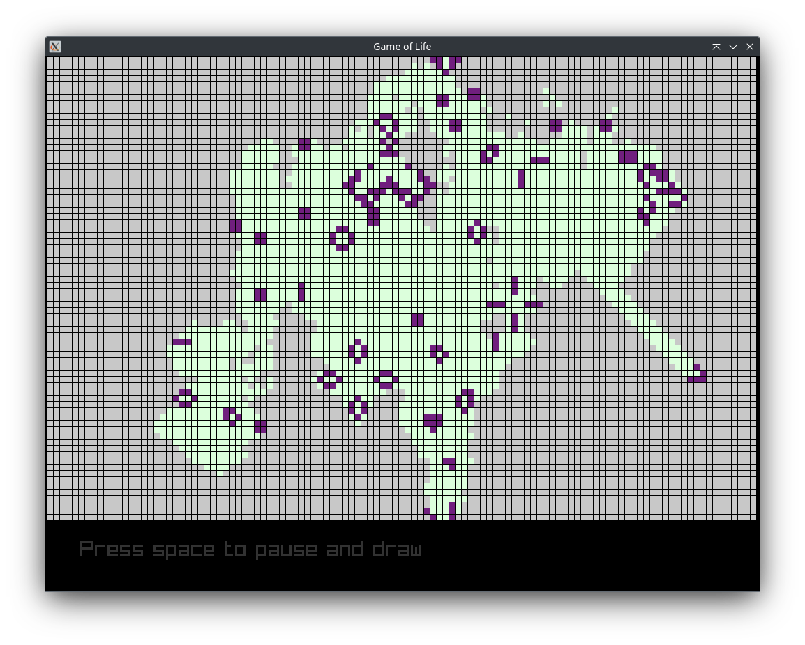

an implementation of Conway's Game of Life in Odin and Raylib 

<picture>
 
</picture>
It is interactive! 
You can draw by pausing the simulation and left or right clicking on the grid, 
there is also a secret "life explosion" button that will fill the grid randomly. 

https://en.wikipedia.org/wiki/Conway's_Game_of_Life  
https://odin-lang.org/  
https://www.raylib.com/  
